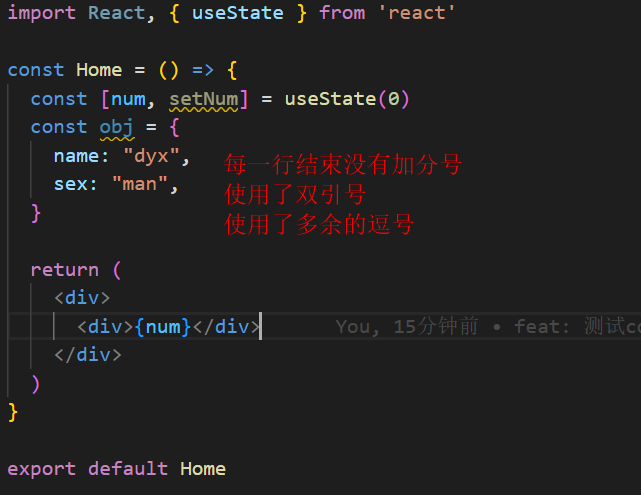
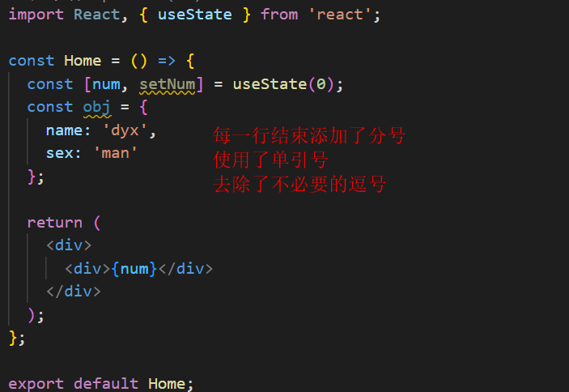
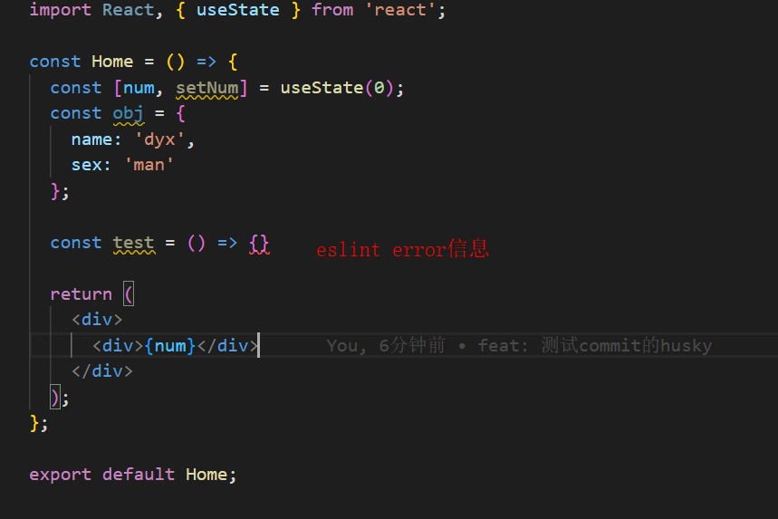
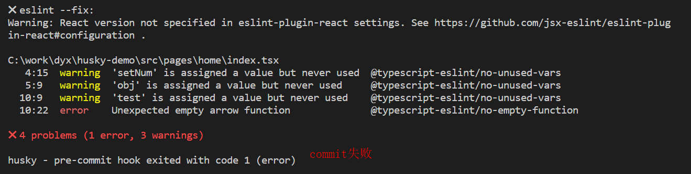

## Eslint + Prettier + husky + lint-staged规范前端项目
### 代码检查工具 Eslint
- 安装依赖
```
npm i eslint -D
```
- 初始化eslint配置(根据提示进行选择) 
  1. 选择 To check syntax and find problems (检查语法和查找错误)
  2. 选择ES Module的模块规范
  3. 选择react框架
  4. 选择使用TypeScript
  5. 选择browser运行环境
  6. 选择使用js文件作为配置文件
  7. 根据选择安装推荐的相关依赖 eslint-plugin-react、 @typescript-eslint/eslint-plugin、 @typescript-eslint/parser
  8. 生成.eslintrc.js配置文件
```
npx eslint --init
```
- 初始化配置之后，不满足规范的代码可以在编辑器中看到。vscode可在终端的问题tab下查看。
### 代码风格工具 prettier
- 安装依赖
```
npm i prettier eslint-config-prettier eslint-plugin-prettier -D
```
- 在.eslintrc.js文件中的extend中添加"prettier"解决eslint和prettier的冲突。
- 创建.prettierrc文件，并配置自己的规则。
```
{
  "semi": true, // 每个语句的末尾添加分号。
  "tabWidth": 2, // 缩进的空格数为2
  "trailingComma": "none", // 没有尾随的逗号
  "singleQuote": true, // 使用单引号
  "arrowParens": "avoid" // 箭头函数的参数尽可能的省略括号
}
```
### git提交前的钩子 husky + lint-staged
- 安装husky依赖
```
npm i husky -D
```
- 在packgae.json中添加prepare脚本
> prepare脚本会在npm install（不带参数）之后自动执行。当执行npm install安装完项目依赖后会执行 husky install命令，该命令会创建.husky/目录并指定该目录为git hooks所在的目录。

```
// 添加prepare脚本
npm set-script prepare "husky install"

// package.json
{
  "scripts": {
    "prepare": "husky install"
  }
}

// 初始化husky，创建.husky/目录并指定该目录为git hooks所在的目录
npm run prepare
```
- 安装lint-staged
> 每一次提交只检查本次提交所修改(指git暂存区里的东西)的问题，而不是每次检查是整个项目的文件的问题。

```
npm install lint-staged -D
```
- package.json 添加 lint-staged的命令
> src/**/*.{js,jsx,ts,tsx} 只对src目录下的js,jsx,ts,tsx文件进行格式化，对应的三条命令会先后分别执行，Eslint --fix 之后使用 Prettier 格式化代码，然后 git add，最后执行我们的git commit。

```
"lint-staged": {
  "src/**/*.{js,jsx,ts,tsx}": [
    "eslint --fix",
    "prettier --write",
    "git add"
  ]
},
```
- 设置pre-commit 执行 npx lint-staged 指令
```
npx husky add .husky/pre-commit "npx lint-staged"
```
### 测试commit效果
- 提交时 Prettier 会格式化代码。


- 存在eslint的error信息时commit失败。
> eslint存在error信息时才会阻止提交(warning信息不会阻止提交)，如果阻止了commit提交，Prettier不会再格式化代码。




  
